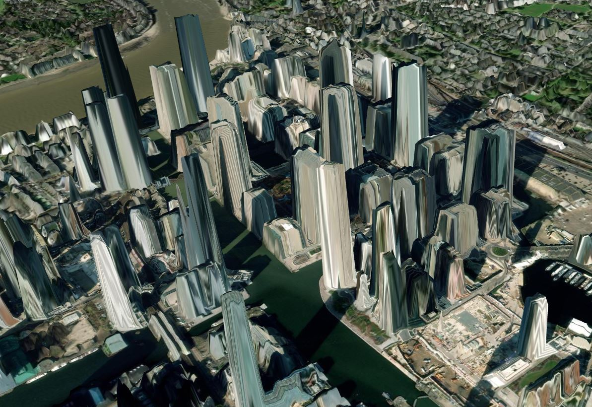
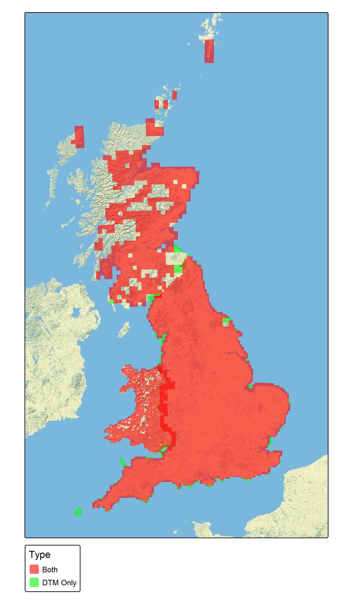

# GBDEM
A free Open Data two metre resolution Digital Terrain Model (DTM) and Digital Surface Model (DSM) of Great Britain.

A [Digital Elevation Model](https://en.wikipedia.org/wiki/Digital_elevation_model) (DEM) is typically a raster datasets where each pixel in the image contains information on the elevation above sea level. The typically come in two versions Terrain (DTM) which gives the elevation of the ground and Surface (DSM) that includes things above the ground such as buildings and trees.

In the Great Britain the easiest way to get at Digital Terrain Model is to use the [OS Terrain 50](https://www.ordnancesurvey.co.uk/products/os-terrain-50) which is free Open Data. However it only has a 50m resolution and the higher resolution [OS Terrain 5](https://www.ordnancesurvey.co.uk/products/os-terrain-5) is only available at commercial rates.

This repo is an attempt to produce a single high resolution (2 metre) DTM and DSM for Great Britain. It uses Open LIDAR data published by the Uk Government under the Open Government Licence and has a high but not complete coverage of Great Britain.


Example of hill shading based on the OS Terrain 50 (left) and the GBDEM 2 metre (right). 


Example of draping aerial photography over at DEM OS Terrain 50 DTM (left) and the GBDEM 2 metre DTM plus extracted building heights (right). 

High resolution DEMs have several applications, but the main focus of this work is extracting 3D building footprints.



Example of aerial photography draped over the the Digital Surface Map. 

## Source Data

1. England - [Environment Agency LIDAR](https://www.data.gov.uk/dataset/f0db0249-f17b-4036-9e65-309148c97ce4/national-lidar-programme) (>90% coverage)
1. Wales - [Welsh Government LIDAR](https://datamap.gov.wales/maps/lidar-viewer/) (~70% coverage)
1. Scotland - [Scottish Government LIDAR](https://remotesensingdata.gov.scot/data#/list) (~40% Coverage)
1. OS Open50 - 50m DTM used to fill in gaps (100% coverages)



Approximate coverage of the high resolution data. Note this map is based on British National Grid squares, and so only shows that some data is available within the grid square, not that the square is fully mapped.

Data is taken for most recent available year, but in some places this can be several years old. 

## Method

I tried Several methods with scripts in the repo but this is the final working method. Ignore other scripts.

### In R

***Country Specific***
Unzip/open and downscale to 2m resolution as required

***GB_10km_tiles.R***
Take small tiles from and make into larger tiles that match the OS National Grid 10km tiles (e.g. NS80). This resolves boarder issues between datasets and some minor misalignments.


***GB_10km_fill_in_gaps.R***
Replace any missing values in the LIDAR data with OS Open 50 Terrrain Data. This is low resolution but give the output national coverage.

***GB_10km_building_heights.R***
For each 10km raster creates a difference raster (DSM - DTM) and uses that to calculate building heights and volumes for the OS Open Vector Stack Buildings. 

Planned improvement is to replace OS buildings with OSM where available and split up the OS buildings with the INSPIRE polygons. OSM buildings tend to be more detailed, and OS groups terraced buildings into a single long building.

***GB_10km_mosaic.R***
Mosaic the 10km rasters into a single large raster of whole GB (about 95 GB compressed TIF)

### In QGIS

Reproject the raster from epsg:27700 to epsg:3857

Command to use:

```gdalwarp -s_srs EPSG:27700 -t_srs EPSG:3857 -dstnodata 0.0 -r near -multi -of GTiff -co COMPRESS=DEFLATE -co PREDICTOR=3 -co ZLEVEL=9 -co BIGTIFF=YES -co NUM_THREADS=30 F:\DTM_DSM\large_rasters\GB\GB_DTM_27700.tif C:/tiles/GB_DTM_3857.tif```

Key Points

1. `-dstnodata 0.0` replace nodata value with 0, this is important later as RGB raster can't have very large or very small values
1. `-co COMPRESS=DEFLATE -co PREDICTOR=3 -co ZLEVEL=9`  use best compression as very large files 
1. `-co BIGTIFF=YES` Use big TIFF or fails (> 4GB)
1. `-co NUM_THREADS=30` Use multicore
1. `C:/tiles/GB_DTM_3857.tif` write to SSD or will be limited by disk speed

This will still take a day to do

OPTIMISATION use TILED=YES ????

Then use gdal warp to change the nodatavalue to none `-dstnodata None`. Otherwise RGB files have black dots for 0m elevation
https://mapscaping.com/nodata-values-in-rasters-with-qgis/ 

```
gdalwarp -s_srs EPSG:3857 -t_srs EPSG:3857 -r near -multi -of GTiff -co COMPRESS=DEFLATE -co PREDICTOR=2 -co ZLEVEL=9 -co BIGTIFF=YES -co NUM_THREADS=30 -dstnodata None  C:/tiles/GB_DTM_3857_nodata.tif C:/tiles/GB_DTM_3857_nodata2.tif
```

https://github.com/syncpoint/terrain-rgb/blob/master/README.md 


### In Windows Subsystem for Linux

Convert from single band to RGB encoded with `rio-rgbify`.

``` rio rgbify -b -10000 -i 0.1 --workers 10 --co BIGTIFF=YES --co TILED=YES GB_DTM_3857_nodata.tif GB_DSM_RGB.tif```

Key Points

1. rio rgbify can go straight to mbtiles but I got loads of errors so go to anther raster first
1. `-b -10000 -i 0.1` use mapbox encoding nothing else seems to worth with MapLibre
1. `--workers 10` this is ram limited so can use some but not all mulitcore
1. `--co BIGTIFF=YES` still need to use big tif
1. `--co TILED=YES` massive performance impact on the tileing stage (later)

This will take a night to run

## Powershell

Onetime install of QGIS processing
```
 c:\OSGeo4W\bin\qgis_process-qgis.bat

```
```
processing.run("qgis:tilesxyzdirectory", {'EXTENT':'-1040892.679200000,310376.142900000,6405989.265200000,8614934.383400001 [EPSG:3857]','ZOOM_MIN':6,'ZOOM_MAX':14,'DPI':192,'BACKGROUND_COLOR':QColor(0, 0, 0, 0),'TILE_FORMAT':0,'QUALITY':75,'METATILESIZE':4,'TILE_WIDTH':512,'TILE_HEIGHT':512,'TMS_CONVENTION':False,'OUTPUT_DIRECTORY':'C:\\tiles\\DTM_QGIS','OUTPUT_HTML':'C:/tiles/DTM_QGIS/leaflet.html'})
```

### Back in QGIS

Generate XYZ Tiles (directory)

QGIS doesn't have the option to create webp tiles, so create PNG tiles. This could be a bug as the WEBP driver has been added to GDAL since version 3.6

The mbtiles version can't create high res (512x512) images so create individual pictures first

Use a custom background colour to avoid obvious edge to the tiles.


### Back in Windows Subsystem for Linux

Convert to webp using imagemagic

For Zoom 0 to 10 goes from 200 MB to 127 MB

```
find . -type f -name "*.png" -exec mogrify -format webp -define webp:lossless=true {}  \; -print
find . -type f -name "*.png" -exec rm {}  \; -print
```

Convert to mbtiles

```
cd ..
mb-util --image_format=webp DTM_QGIS DTM_QGIS.mbtiles
```

Convert to pmtiles

```
./pmtiles convert DTM_QGIS.mbtiles DTM_QGIS.pmtiles
```
For Zoom 0 to 10 is to 130 MB


## Outputs

Data Downloads are provided at [www.carbon.place](https://www.carbon.place/data).

Currently due to the size of these datasets only the `.pmtiles` format is provided with `webp` encoding.

Please get in contact if you need the original 87GB GeoTiffs.


